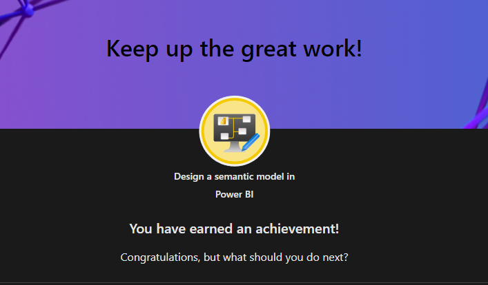
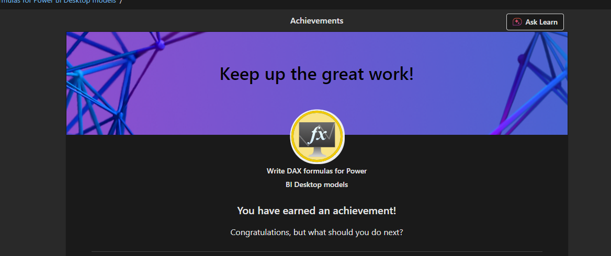

# ✅ PL-300 Power BI Data Analyst Exam – Study Checklist

## 📁 1. Prepare the Data (15–20%)
- [X] Get data from Excel, SQL Server, SharePoint, Web, etc.  
    - get Data in Power BI Lab 
- [X] Use Power Query to clean and transform data  
    - Clean, transform, and load data in Power BI Lesson & Lab
- [X] Apply data profiling in Power Query  
    - Clean, transform, and load data in Power BI Lesson& Lab
- [X] Handle missing or incorrect data  
    - Clean, transform, and load data in Power BI Lesson & Lab
- [X] Merge and append queries  
    - Clean, transform, and load data in Power BI Lesson & Lab
- [X] Apply transformations (split, replace, pivot, unpivot, etc.)
    - Clean, transform, and load data in Power BI Lesson & Lab 
- [X] Load data into Power BI model  
    - Clean, transform, and load data in Power BI Lesson & Lab
## 📊 2. Model the Data (30–35%)
- [X] Design relationships between tables (1:1, 1:*, cross-filtering)  
    - Design a semantic model in Power BI lesson & lab
- [ ] Normalize and denormalize data  
- [X] Create calculated columns
    - Write DAX formulas for PowerBI lesson  
- [x] Create measures using DAX  
    - Write DAX formulas for PowerBI lesson
- [ ] Use time intelligence functions (YTD, MTD, SAMEPERIODLASTYEAR, etc.)  
- [X] Use core DAX functions (CALCULATE, FILTER, SUMX, IF, etc.)  
    - Write DAX formulas for PowerBI lesson
- [ ] Optimize model performance (reduce cardinality, choose correct data types)  
- [X] Use star schema for efficient modeling  

## 📈 3. Visualize and Analyze the Data (25–30%)
- [ ] Create standard visuals (bar, line, matrix, slicers, etc.)  
- [ ] Use drillthrough, bookmarks, and report tooltips  
- [ ] Implement custom visuals from marketplace  
- [ ] Apply conditional formatting  
- [ ] Apply themes and custom layouts  
- [ ] Enable Q&A visual and configure suggested questions  
- [ ] Add filters (page, report, visual level)  
- [ ] Perform forecasting and trend analysis  
- [ ] Use decomposition tree and clustering visuals  

## 🚀 4. Deploy and Maintain Assets (20–25%)
- [ ] Understand Power BI Desktop vs Service  
- [ ] Manage datasets and data refresh schedules  
- [ ] Set up and use dataflows  
- [ ] Publish reports to workspaces  
- [X] Create and manage Power BI Apps for deployment  
    - PowerBI Apps - YT video 'Guy in a Cude'
- [ ] Use shared datasets  
- [ ] Assign workspace roles (Admin, Member, Contributor, Viewer)  
- [ ] Implement Row-Level Security (RLS)  
- [ ] Configure permissions on datasets and reports 

## Achievement Gallery 

📸 Click to view my completed assessments & learning path screenshots

 

    
  
  
  
    <!-- Add more as needed -->

